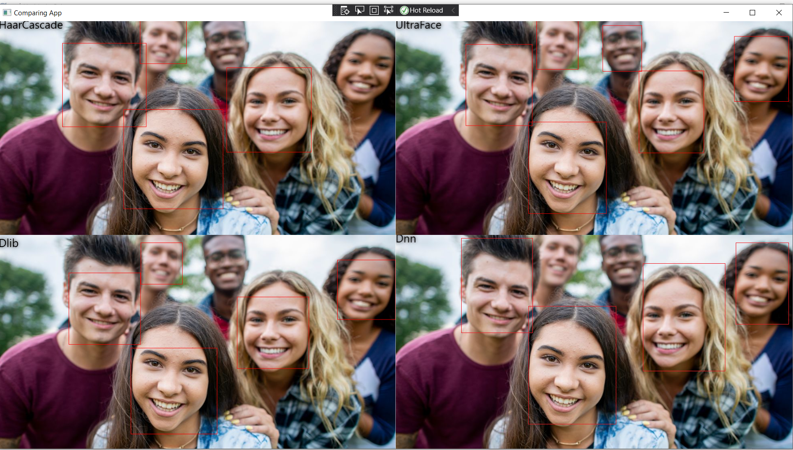

# Comparison-of-face-detection-algorithms-available-in-.Net
A real time application that compares four libraries to face detection avaible in C#. 

## Face detection libraries that was compared. 

- [FaceRecognitionDotNet](https://github.com/takuya-takeuchi/FaceRecognitionDotNet).
- [UltraFaceDotNet](https://github.com/takuya-takeuchi/UltraFaceDotNet). Dlib model is from here https://github.com/davisking/dlib-models. 
- [HarrCascade](https://github.com/shimat/opencvsharp).
- [Dnn](https://github.com/emgucv). 

### Face detection algorithms from this libraries are descriped here https://www.learnopencv.com/face-detection-opencv-dlib-and-deep-learning-c-python/. 

## Application architecture.

- The app is based on MVVM pattern. 
- The app uses the default microsoft cointainer to Dependency Injection. 
- The app settings are loaded from appsetting.json file. 
User can change application propeties in appsettings.json file. (For example user can change camera device id or algorithm resolution in this file.)
- App uses .Net core in version 3.1. 

# 2022 to do

- bump to .net6
- refactor code
- use default .net DI container - done
- use the newest version of algorithms
